# ComponentCraft AI: USWDS Component Generation for Drupal Developers (Advanced Edition)

*A specialized MCP server for generating USWDS-compliant Drupal components from Figma designs with enhanced features for maximum value*

## Table of Contents

- [Executive Summary](#executive-summary)
- [Problem Statement](#problem-statement)
- [Solution Overview](#solution-overview)
- [Technical Architecture](#technical-architecture)
- [Market Analysis](#market-analysis)
- [Investment Plan](#investment-plan)
- [Monetization Strategy](#monetization-strategy)
- [User Scenarios](#user-scenarios)
- [Advanced Value Enhancements](#advanced-value-enhancements)
  - [Knowledge Transfer & Learning Platform](#knowledge-transfer--learning-platform)
  - [Component Governance & Compliance Dashboard](#component-governance--compliance-dashboard)
  - [Component Evolution & Lifecycle Management](#component-evolution--lifecycle-management)
  - [Cross-Agency Component Sharing](#cross-agency-component-sharing)
  - [Intelligent Component Recommendations](#intelligent-component-recommendations)
  - [End-to-End Workflow Integration](#end-to-end-workflow-integration)
  - [Performance & Accessibility Optimization](#performance--accessibility-optimization)
  - [Security-First Component Architecture](#security-first-component-architecture)
  - [Customization Without Complexity](#customization-without-complexity)
  - [Agency-Specific Knowledge Base](#agency-specific-knowledge-base)
- [Advanced User Scenarios](#advanced-user-scenarios)
- [Enhanced Implementation Roadmap](#enhanced-implementation-roadmap)
- [Risk Assessment](#risk-assessment)
- [Conclusion](#conclusion)

## Executive Summary

ComponentCraft AI is a specialized Model Context Protocol (MCP) server that helps Drupal developers quickly generate U.S. Web Design System (USWDS) compliant components from Figma designs. By focusing specifically on the intersection of USWDS and Drupal, ComponentCraft AI addresses a critical pain point for government website developers: the repetitive, time-consuming process of rebuilding the same components across different projects.

Our solution leverages AI to analyze Figma designs, match them to USWDS patterns, and generate production-ready Drupal code with proper integration. By providing specialized templates and implementation patterns, ComponentCraft AI significantly reduces development time, ensures compliance with government standards, and improves code quality.

The business operates on a subscription model with tiered pricing based on usage, targeting Drupal developers working on government websites, web agencies with government contracts, and government IT departments.

**Advanced Edition Enhancement**: This advanced edition of ComponentCraft AI goes beyond basic component generation to create a comprehensive platform that transforms government web development. With features like knowledge transfer, compliance governance, component sharing, and intelligent recommendations, ComponentCraft AI becomes an indispensable tool that continuously improves, facilitates collaboration, and ensures the highest standards of quality and compliance.

## Problem Statement

### Core Problems

1. **Repetitive Component Rebuilding**: Drupal developers working on government websites must repeatedly rebuild the same USWDS components for each new project, wasting time and resources.

2. **Compliance Challenges**: Ensuring components meet USWDS specifications and accessibility requirements is complex and error-prone.

3. **Design-to-Code Gap**: Translating Figma designs to USWDS-compliant Drupal components requires specialized knowledge of both systems.

4. **Integration Complexity**: Different Drupal implementation approaches (blocks, views, paragraphs) require different code patterns.

### Market Impact

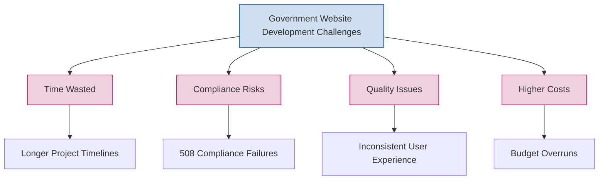

### Quantified Problem

- **Time Cost**: Developers spend 4-8 hours per component on implementation
- **Project Impact**: Average government site uses 15-20 USWDS components
- **Financial Impact**: At $100/hour developer rate, component development costs $6,000-16,000 per project
- **Quality Issues**: 30% of government sites fail accessibility compliance on first audit

**Advanced Edition Enhancement**: Beyond these core problems, government web development faces additional challenges:

1. **Knowledge Silos**: Expertise in USWDS and Drupal integration is concentrated in a few developers
2. **Compliance Drift**: Components fall out of compliance as standards evolve
3. **Duplication Across Agencies**: Similar components are rebuilt by different agencies
4. **Security Vulnerabilities**: Components may not follow security best practices
5. **Performance Issues**: Components are often not optimized for performance

## Solution Overview

ComponentCraft AI is a specialized MCP server that integrates with AI coding assistants like Cline to provide USWDS component generation capabilities for Drupal developers.

### Key Features

1. **Figma Design Analysis**: Extract design tokens and identify USWDS patterns from Figma designs
2. **Component Template Library**: Comprehensive library of USWDS components with Drupal integration
3. **Multiple Implementation Options**: Support for blocks, views, paragraphs, and other Drupal patterns
4. **Theme Integration**: Seamless integration with existing or new Drupal themes
5. **Accessibility Compliance**: Built-in accessibility validation and best practices
6. **Code Generation**: Production-ready, well-documented code output

### Value Proposition

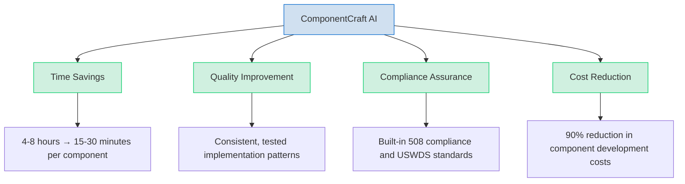

### Differentiation from General AI Tools

| Aspect | General AI Assistants | ComponentCraft AI |
|--------|----------------------|------------------|
| Knowledge Depth | Broad but shallow | Deep expertise in USWDS + Drupal |
| Workflow | Generic coding assistance | Purpose-built for USWDS components |
| Output | Code snippets | Complete, ready-to-use components |
| Compliance | Inconsistent | Guaranteed USWDS compliance |
| Design Integration | Limited | Direct Figma integration |
| Drupal Optimization | Generic code | Drupal-specific optimizations |

## Technical Architecture

### System Architecture

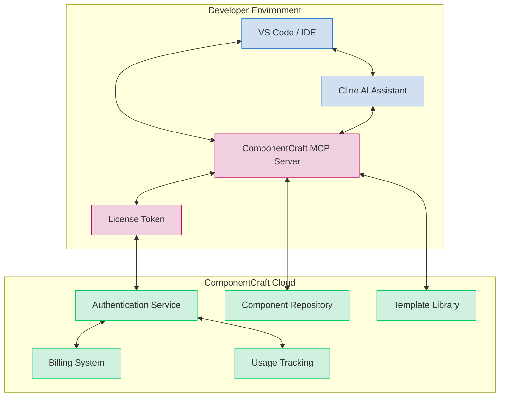

### Integration with Cline

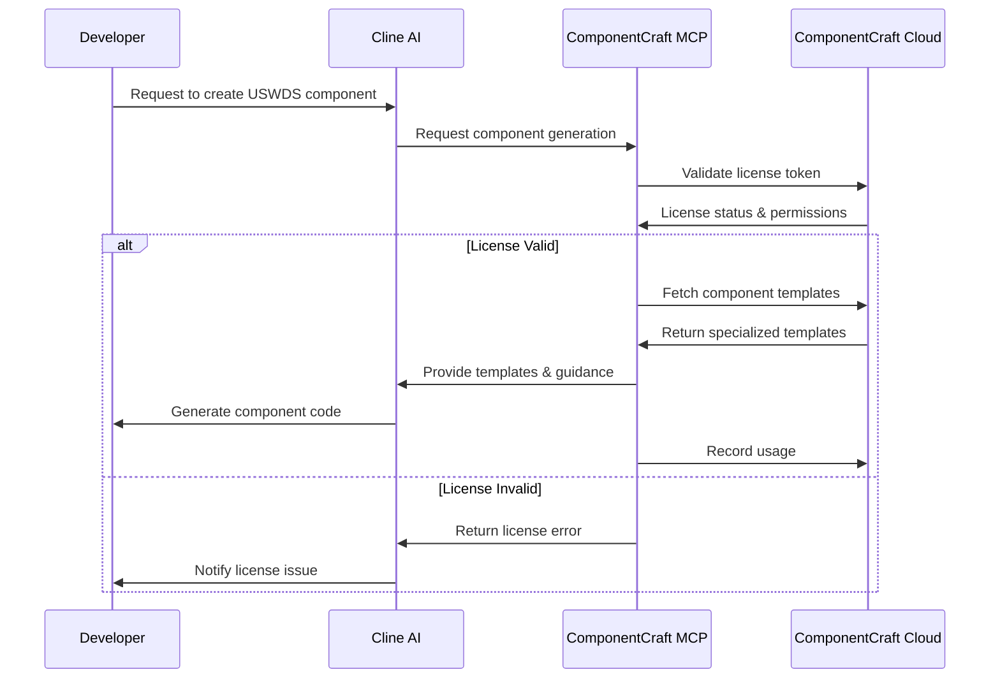

### Figma Integration

We'll use a hybrid approach that leverages the existing Figma MCP while adding our specialized functionality:

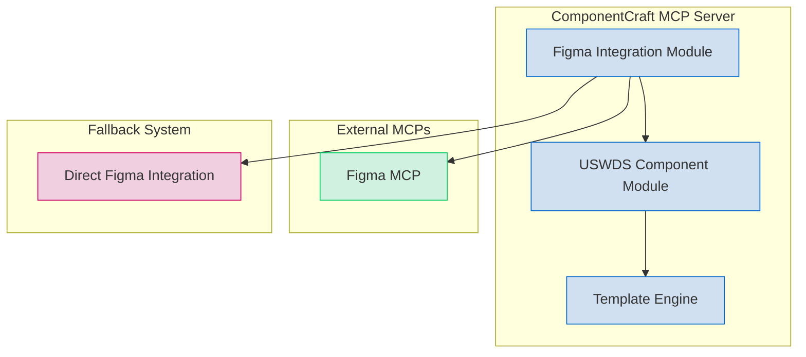

### Security & Licensing

To protect our intellectual property while allowing local execution, we'll implement:

1. **Split Functionality Architecture**: Core templates and AI models in the cloud, interface on local machine
2. **License Token System**: Secure JWT-based tokens with regular validation
3. **Usage Tracking**: Monitor component generation for billing
4. **Offline Capabilities**: Limited offline usage with synchronization

## Market Analysis

### Target Customers

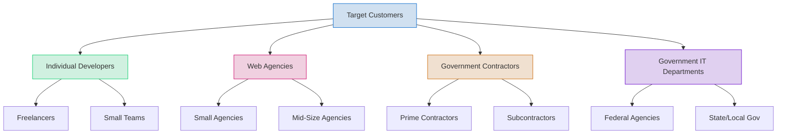

### Market Size

- **Drupal Government Sites**: 2,000+ federal government sites use Drupal
- **Government Web Spending**: $3B+ annual spending on government websites
- **Drupal Developers**: 20,000+ developers working on government Drupal sites
- **USWDS Adoption**: Growing mandate for USWDS compliance across agencies

### Competitive Landscape

| Competitor Type | Examples | Strengths | Weaknesses |
|----------------|----------|-----------|------------|
| General AI Coding Tools | GitHub Copilot, Cline, Cursor | Broad capabilities | Limited USWDS/Drupal expertise |
| Drupal Themes | USWDS Drupal Theme | Pre-built components | Limited customization |
| Component Libraries | USWDS React, USWDS Web Components | Ready-to-use components | Not Drupal-specific |
| Custom Development | Agency services | Tailored solutions | Expensive, time-consuming |

## Investment Plan

### Development Costs

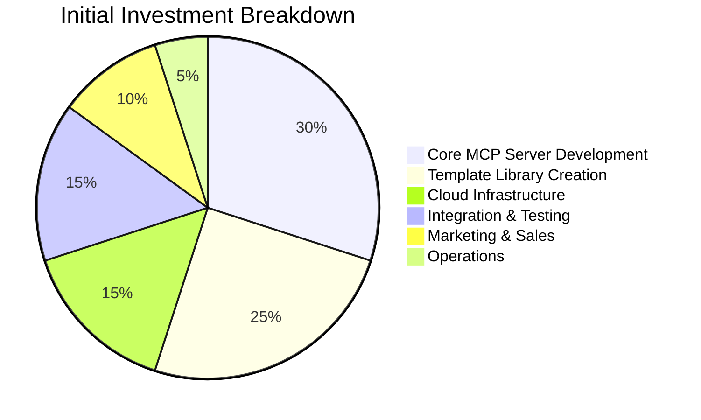

### Financial Requirements

- **MVP Development**: $150,000-250,000
- **Full Product Development**: $350,000-500,000
- **Marketing & Sales**: $100,000-150,000
- **Operations (Year 1)**: $200,000-300,000
- **Total Initial Investment**: $650,000-1,000,000

### Development Timeline

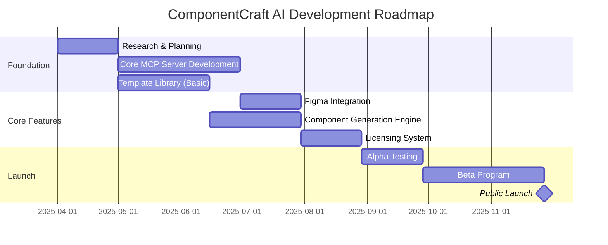

## Monetization Strategy

### Pricing Models

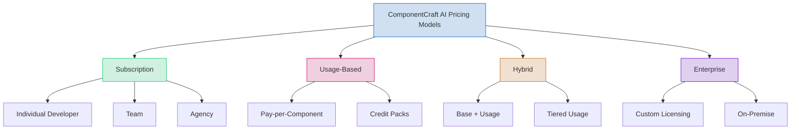

### Subscription Tiers

| Feature | Starter ($19.99/mo) | Professional ($49.99/mo) | Agency ($199.99/mo) |
|---------|---------------------|--------------------------|---------------------|
| Components/mo | 10 | 50 | Unlimited |
| Users | 1 | 3 | 10 |
| Custom library | ✓ | ✓ | ✓ |
| Figma integration | Basic | Advanced | Advanced |
| Team collaboration | - | ✓ | ✓ |
| Priority support | - | ✓ | ✓ |
| White label | - | - | ✓ |
| API access | - | - | ✓ |

### Revenue Projections

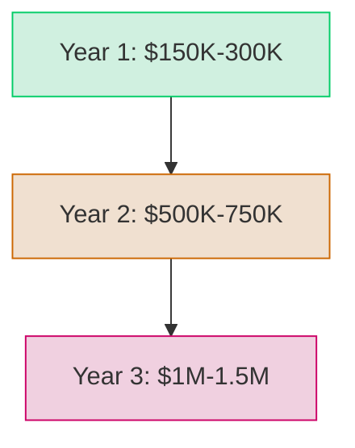

### Customer Acquisition Cost (CAC) and Lifetime Value (LTV)

| Metric | Individual | Agency | Enterprise |
|--------|------------|--------|------------|
| Avg. CAC | $200 | $1,000 | $5,000 |
| Monthly ARPU | $30 | $200 | $2,000 |
| Avg. Lifetime | 18 months | 36 months | 48 months |
| LTV | $540 | $7,200 | $96,000 |
| LTV:CAC Ratio | 2.7:1 | 7.2:1 | 19.2:1 |

## User Scenarios

### Scenario 1: Individual Developer with Figma Design

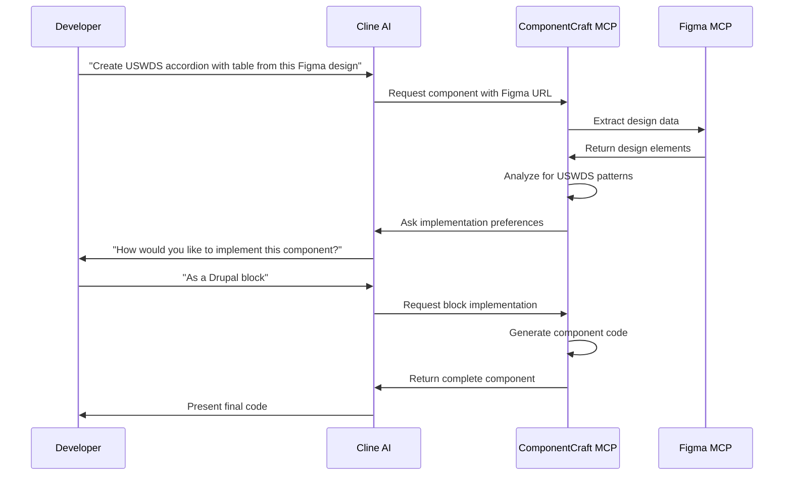

**Before ComponentCraft AI:**
- Developer spends 6 hours manually coding the component
- Needs to research USWDS specifications
- Must test for accessibility compliance
- Has to implement Drupal integration patterns

**After ComponentCraft AI:**
- Complete component generated in 15 minutes
- USWDS compliance guaranteed
- Accessibility built-in
- Drupal integration handled automatically

### Scenario 2: Agency Team Building Government Site

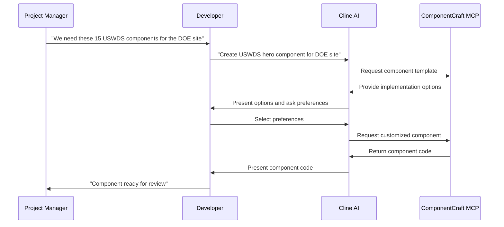

**ROI Calculation:**
- 15 components × 6 hours each = 90 hours of development time
- 90 hours × $100/hour = $9,000 cost
- With ComponentCraft AI: 15 components × 30 minutes = 7.5 hours
- 7.5 hours × $100/hour = $750 cost
- **Savings: $8,250 (92% reduction)**

### Scenario 3: Government IT Department with Existing Theme

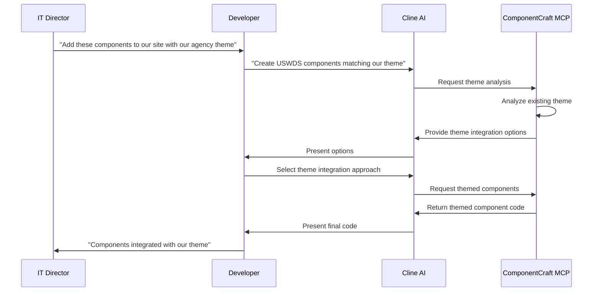

**Value Proposition:**
- Consistent branding across components
- Maintains agency design system
- Reduces theme integration time by 80%
- Ensures compliance with agency standards

## Advanced Value Enhancements

The Advanced Edition of ComponentCraft AI includes several key enhancements that bring additional value to government web developers and agencies. These features transform ComponentCraft AI from a component generation tool into a comprehensive platform for government web development.

### Knowledge Transfer & Learning Platform

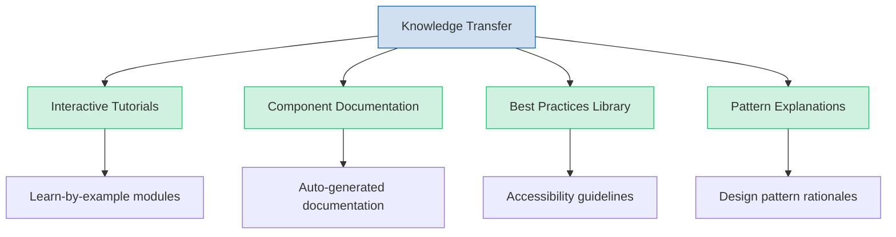

**Implementation:**
- Embed contextual learning within the component generation process
- Provide explanations of why certain patterns are used
- Include accessibility rationales with each component
- Create interactive tutorials for USWDS/Drupal integration

**Value to Users:**
- Developers gain expertise while using the tool
- Teams build institutional knowledge
- Reduces dependency on specialized training
- Accelerates onboarding of new team members

**Why This Matters:**
Government agencies often struggle with knowledge transfer when developers leave or projects transition. By embedding learning into the workflow, ComponentCraft AI ensures that knowledge is retained and shared across the organization. This is particularly valuable for agencies with high turnover or those relying on contractors.

**Example Scenario:**
A junior developer joins a government agency and is tasked with maintaining a USWDS-based Drupal site. Instead of spending weeks learning the intricacies of USWDS and Drupal integration, they use ComponentCraft AI to generate components while learning the underlying patterns and best practices. The contextual explanations help them understand why certain approaches are used, accelerating their proficiency.

### Component Governance & Compliance Dashboard

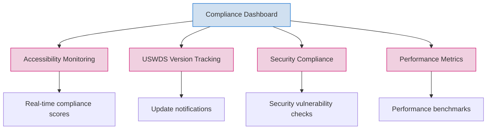

**Implementation:**
- Create a real-time dashboard for monitoring component compliance
- Automated scanning of generated components against latest standards
- Proactive alerts for compliance issues or USWDS updates
- Integration with government compliance frameworks (NIST, FedRAMP)

**Value to Users:**
- Continuous compliance assurance
- Reduced audit preparation time
- Proactive rather than reactive compliance
- Documentation for Authority to Operate (ATO) processes

**Why This Matters:**
Government websites must meet strict compliance requirements, and failures can lead to legal issues, security vulnerabilities, and accessibility complaints. The compliance dashboard provides continuous monitoring and early warning of potential issues, allowing teams to address problems before they impact users or trigger compliance violations.

**Example Scenario:**
The Department of Education is preparing for a Section 508 compliance audit. Instead of scrambling to test all components manually, they use the ComponentCraft AI compliance dashboard to generate a comprehensive report of all components, their compliance status, and any remediation needed. This reduces audit preparation from weeks to hours and ensures no issues are overlooked.

### Component Evolution & Lifecycle Management

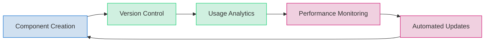

**Implementation:**
- Track component usage across projects
- Monitor performance and user interaction metrics
- Provide automated update paths when USWDS changes
- Enable A/B testing of component variations

**Value to Users:**
- Components improve over time
- Reduced technical debt
- Data-driven component optimization
- Seamless updates to latest standards

**Why This Matters:**
Components often stagnate after initial development, leading to technical debt and compliance drift as standards evolve. By managing the full lifecycle of components, ComponentCraft AI ensures they remain current, performant, and compliant throughout their lifespan.

**Example Scenario:**
USWDS releases a major update with significant changes to the accordion component. Instead of manually updating all instances across multiple sites, an agency uses ComponentCraft AI's lifecycle management to identify all affected components and automatically generate update paths. The system provides before/after comparisons and handles the migration of content and configuration, reducing update time from days to hours.

### Cross-Agency Component Sharing

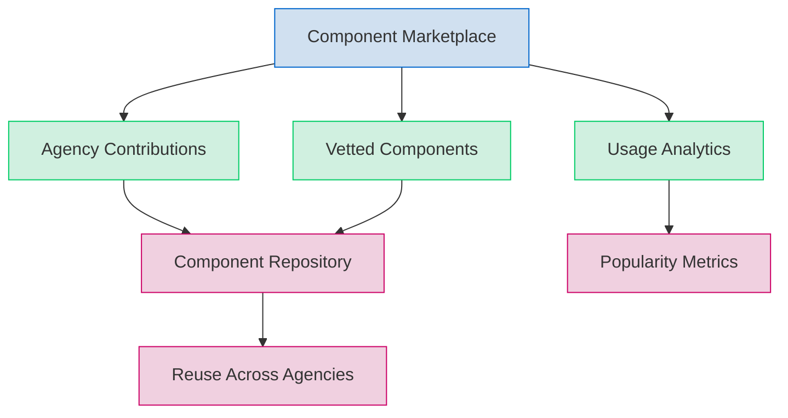

**Implementation:**
- Create a secure marketplace for sharing agency-specific components
- Implement verification and security scanning for shared components
- Track usage and provide attribution
- Enable agencies to collaborate on component development

**Value to Users:**
- Access to specialized components from other agencies
- Reduced duplication of effort across government
- Community-driven innovation
- Recognition for contributing agencies

**Why This Matters:**
Government agencies often solve similar problems independently, leading to duplication of effort and inconsistent implementations. A component marketplace enables agencies to share their solutions, learn from each other, and build on existing work rather than starting from scratch.

**Example Scenario:**
The Department of Veterans Affairs develops a specialized form component for benefits applications. Through the ComponentCraft AI marketplace, they share this component with other agencies. The Social Security Administration discovers this component and adapts it for their own benefits forms, saving weeks of development time and providing a consistent experience for citizens across different government services.

### Intelligent Component Recommendations

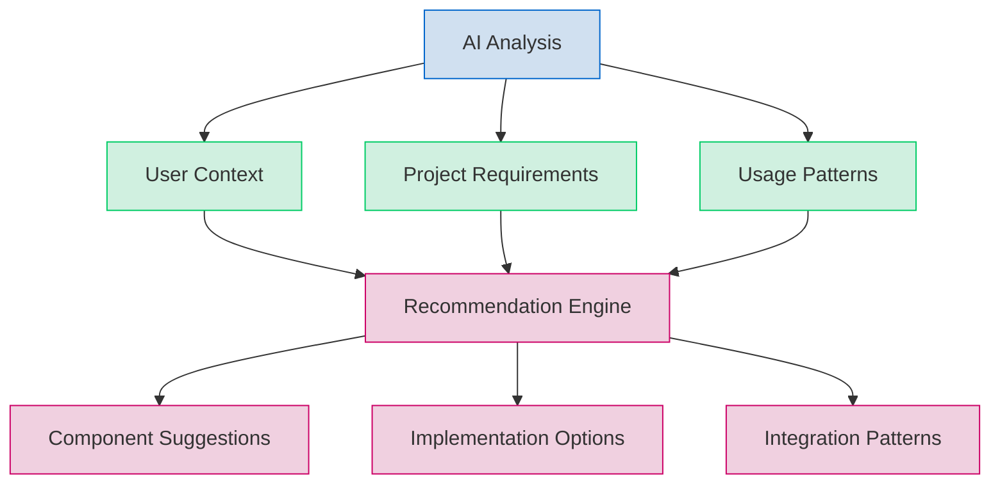

**Implementation:**
- Analyze project context to suggest appropriate components
- Learn from user preferences and project patterns
- Recommend optimal implementation approaches
- Suggest component combinations for common use cases

**Value to Users:**
- Discover components they might not know about
- Optimize component selection for specific needs
- Reduce decision fatigue
- Learn best practices through recommendations

**Why This Matters:**
Developers often default to familiar components rather than exploring the full range of options available. Intelligent recommendations expose developers to the most appropriate components for their specific needs, leading to better user experiences and more efficient implementations.

**Example Scenario:**
A developer is building a data-heavy page for the EPA. Based on the content structure and project requirements, ComponentCraft AI recommends using a combination of the USWDS table component with filtering capabilities and a summary card component to highlight key metrics. The developer wasn't aware of these specific components and implementation patterns, but the recommendation leads to a more effective solution than they would have created on their own.

### End-to-End Workflow Integration

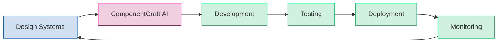

**Implementation:**
- Integrate with design system tools beyond Figma (Sketch, Adobe XD)
- Connect with CI/CD pipelines for automated testing
- Provide deployment scripts and configuration
- Integrate with monitoring tools for post-deployment insights

**Value to Users:**
- Seamless workflow from design to production
- Reduced context switching between tools
- Automated quality assurance
- Full lifecycle visibility

**Why This Matters:**
The fragmentation of the development workflow across multiple tools creates inefficiencies and opportunities for errors. By integrating with the entire workflow, ComponentCraft AI reduces friction, eliminates manual handoffs, and ensures consistency from design to deployment.

**Example Scenario:**
A government contractor is building a new site for the National Park Service. They use ComponentCraft AI's workflow integration to connect their Figma designs directly to their CI/CD pipeline. As designers update components in Figma, ComponentCraft AI automatically generates updated code, runs tests, and prepares deployment packages. This continuous integration reduces development time by 40% and ensures the final site exactly matches the approved designs.

### Performance & Accessibility Optimization

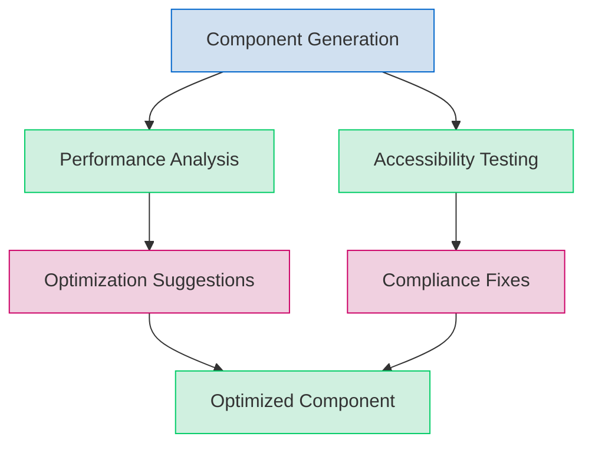

**Implementation:**
- Automated performance testing of generated components
- Real-time accessibility validation against WCAG and Section 508
- AI-powered suggestions for performance improvements
- Automated fixes for common accessibility issues

**Value to Users:**
- Components that are fast by default
- Guaranteed accessibility compliance
- Reduced performance debugging
- Better user experience for government site visitors

**Why This Matters:**
Performance and accessibility are often treated as afterthoughts in component development, leading to slow sites and compliance issues. By integrating performance and accessibility optimization into the component generation process, ComponentCraft AI ensures that all components meet the highest standards from the start, reducing the need for costly remediation later.

**Example Scenario:**
The Centers for Disease Control (CDC) is launching a critical public health information site that needs to handle high traffic volumes and be accessible to all citizens. Using ComponentCraft AI's performance and accessibility optimization, they generate components that are pre-optimized for core web vitals and WCAG 2.1 AA compliance. The site launches with perfect Lighthouse scores and passes all accessibility audits without remediation, saving weeks of optimization work.

### Security-First Component Architecture

```mermaid
graph TD
    A[Security Requirements] --> B[Component Design]
    B --> C[Security Analysis]
    C --> D[Vulnerability Testing]
    D --> E[Security Hardening]
    E --> F[Secure Component]

    style A fill:#d0e0f0,stroke:#0066cc
    style B fill:#d0e0f0,stroke:#0066cc
    style C fill:#f0d0e0,stroke:#cc0066
    style D fill:#f0d0e0,stroke:#cc0066
    style E fill:#f0d0e0,stroke:#cc0066
    style F fill:#d0f0e0,stroke:#00cc66
```

**Implementation:**
- Build components with security best practices by default
- Implement content security policies
- Provide XSS and CSRF protection
- Include security documentation with each component

**Value to Users:**
- Reduced security vulnerabilities
- Compliance with government security requirements
- Simplified security audits
- Protection against common web attacks

**Why This Matters:**
Government websites are prime targets for cyber attacks, and security vulnerabilities can have serious consequences. By building security into components from the ground up, ComponentCraft AI reduces the risk of security breaches and simplifies compliance with government security requirements.

**Example Scenario:**
A federal agency is building a form that collects sensitive citizen information. Using ComponentCraft AI's security-first architecture, they generate a form component with built-in input validation, CSRF protection, and data sanitization. The component passes the agency's security review without issues, avoiding the typical cycle of security findings and remediation that would have added weeks to the project timeline.

### Customization Without Complexity

```mermaid
graph TD
    A[Base Component] --> B[Customization Interface]
    B --> C[Visual Editor]
    B --> D[Code Editor]
    B --> E[Configuration Options]

    C --> F[Customized Component]
    D --> F
    E --> F

    style A fill:#d0e0f0,stroke:#0066cc
    style B fill:#d0e0f0,stroke:#0066cc
    style C fill:#d0f0e0,stroke:#00cc66
    style D fill:#d0f0e0,stroke:#00cc66
    style E fill:#d0f0e0,stroke:#00cc66
    style F fill:#f0d0e0,stroke:#cc0066
```

**Implementation:**
- Provide multiple customization paths (visual, code, configuration)
- Create a no-code interface for non-technical stakeholders
- Implement guardrails to maintain compliance during customization
- Enable theme-based customization for consistent branding

**Value to Users:**
- Flexibility without sacrificing compliance
- Appropriate tools for different skill levels
- Faster iteration on design changes
- Empowerment of non-technical team members

**Why This Matters:**
Government websites often need to balance customization with compliance, and traditional approaches force a trade-off between the two. ComponentCraft AI's customization approach provides the flexibility agencies need while ensuring that customized components remain compliant with standards.

**Example Scenario:**
A state government agency needs to customize USWDS components to match their brand guidelines while maintaining compliance. Using ComponentCraft AI's customization interface, their design team visually adjusts colors, typography, and spacing without writing code. The system automatically ensures all customizations maintain proper contrast ratios and accessibility requirements, allowing the team to achieve their design goals without compromising compliance.

### Agency-Specific Knowledge Base

```mermaid
graph TD
    A[Agency Requirements] --> B[Custom Knowledge Base]
    B --> C[Agency-Specific Templates]
    B --> D[Custom Component Library]
    B --> E[Compliance Requirements]

    C --> F[Tailored Experience]
    D --> F
    E --> F

    style A fill:#d0e0f0,stroke:#0066cc
    style B fill:#d0e0f0,stroke:#0066cc
    style C fill:#d0f0e0,stroke:#00cc66
    style D fill:#d0f0e0,stroke:#00cc66
    style E fill:#d0f0e0,stroke:#00cc66
    style F fill:#f0d0e0,stroke:#cc0066
```

**Implementation:**
- Allow agencies to create private component libraries
- Implement agency-specific compliance rules
- Create custom templates for common agency patterns
- Build knowledge bases for agency-specific requirements

**Value to Users:**
- Components tailored to specific agency needs
- Consistency across agency projects
- Reduced redundant work within agencies
- Preservation of institutional knowledge

**Why This Matters:**
Each government agency has unique requirements, workflows, and compliance considerations. By creating agency-specific knowledge bases, ComponentCraft AI can provide a tailored experience that addresses the specific needs of each agency, increasing relevance and adoption.

**Example Scenario:**
The Department of Defense has specific security requirements that go beyond standard USWDS guidelines. They use ComponentCraft AI to create a custom knowledge base that incorporates these requirements into the component generation process. All components generated through their instance automatically comply with DoD-specific security standards, ensuring consistency across all their web properties and reducing the risk of non-compliance.

## Advanced User Scenarios

### Scenario 4: Cross-Agency Collaboration

```mermaid
sequenceDiagram
    participant Agency1 as Agency 1
    participant Agency2 as Agency 2
    participant MCP as ComponentCraft MCP
    participant Marketplace as Component Marketplace

    Agency1->>MCP: Create specialized form component
    MCP->>Agency1: Generate component
    Agency1->>Marketplace: Share component
    Marketplace->>MCP: Index and verify component
    Agency2->>Marketplace: Search for form component
    Marketplace->>Agency2: Provide component options
    Agency2->>MCP: Request adaptation of component
    MCP->>Agency2: Generate adapted component
```

**Before ComponentCraft AI:**
- Agencies develop similar components independently
- No visibility into other agencies' solutions
- Inconsistent citizen experience across government sites
- Duplication of effort and resources

**After ComponentCraft AI:**
- Agencies share and discover components
- Consistent citizen experience
- Reduced duplication of effort
- Cross-agency collaboration and innovation

**Value Proposition:**
- 70% reduction in development time through component reuse
- Consistent user experience across government sites
- Knowledge sharing across agencies
- More efficient use of taxpayer dollars

### Scenario 5: Continuous Compliance Management

```mermaid
sequenceDiagram
    participant Dev as Developer
    participant MCP as ComponentCraft MCP
    participant Dashboard as Compliance Dashboard
    participant Standards as Standards Updates

    Standards->>MCP: USWDS version update
    MCP->>Dashboard: Flag affected components
    Dashboard->>Dev: Notify of compliance issues
    Dev->>MCP: Request automated updates
    MCP->>Dev: Generate update options
    Dev->>MCP: Approve updates
    MCP->>Dashboard: Update compliance status
```

**Before ComponentCraft AI:**
- Manual tracking of compliance requirements
- Reactive approach to standards updates
- Periodic compliance audits with remediation cycles
- High risk of non-compliance periods

**After ComponentCraft AI:**
- Automated compliance monitoring
- Proactive notification of standards changes
- Continuous compliance status
- Automated update paths

**Value Proposition:**
- 90% reduction in compliance management time
- Elimination of non-compliance periods
- Simplified audit preparation
- Reduced compliance risk

### Scenario 6: Knowledge Transfer and Onboarding

```mermaid
sequenceDiagram
    participant Manager as Project Manager
    participant Junior as Junior Developer
    participant MCP as ComponentCraft MCP
    participant KB as Knowledge Base

    Manager->>Junior: Assign component development
    Junior->>MCP: Request component guidance
    MCP->>KB: Retrieve learning resources
    KB->>Junior: Provide contextual learning
    Junior->>MCP: Generate component with explanations
    MCP->>Junior: Deliver component with documentation
    Junior->>Manager: Complete assignment with understanding
```

**Before ComponentCraft AI:**
- Weeks of onboarding for new developers
- Dependency on senior developers for knowledge transfer
- Inconsistent understanding of standards
- Knowledge loss when developers leave

**After ComponentCraft AI:**
- Accelerated onboarding through contextual learning
- Reduced dependency on senior developers
- Consistent understanding of standards
- Preservation of institutional knowledge

**Value Proposition:**
- 75% reduction in onboarding time
- More efficient use of senior developer time
- Consistent quality regardless of experience level
- Resilience against staff turnover

## Enhanced Implementation Roadmap

The Advanced Edition of ComponentCraft AI requires an expanded implementation roadmap to account for the additional features and capabilities:

```mermaid
gantt
    title ComponentCraft AI Advanced Edition Roadmap
    dateFormat  YYYY-MM-DD
    section Foundation
    Research & Planning           :a1, 2025-04-01, 30d
    Core MCP Server Development   :a2, after a1, 60d
    Template Library (Basic)      :a3, after a1, 45d
    section Core Features
    Figma Integration             :b1, after a2, 30d
    Component Generation Engine   :b2, after a3, 45d
    Licensing System              :b3, after b2, 30d
    section Advanced Features
    Knowledge Transfer Platform   :c1, after b3, 45d
    Compliance Dashboard          :c2, after c1, 30d
    Component Marketplace         :c3, after c2, 45d
    Lifecycle Management          :c4, after c3, 30d
    section Enterprise Features
    Agency Knowledge Bases        :d1, after c4, 45d
    Security Architecture         :d2, after d1, 30d
    Workflow Integration          :d3, after d2, 45d
    section Launch
    Alpha Testing                 :e1, after d3, 30d
    Beta Program                  :e2, after e1, 60d
    Public Launch                 :milestone, after e2, 0d
```

### Phase 1: Foundation (Months 1-3)
- Core MCP server implementation
- Basic USWDS component templates
- Figma integration
- Component generation engine

### Phase 2: Core Features (Months 4-6)
- Expanded component library
- Advanced Figma integration
- Licensing and subscription system
- VS Code extension

### Phase 3: Advanced Features (Months 7-12)
- Knowledge transfer platform
- Compliance dashboard
- Component marketplace
- Lifecycle management
- Performance and accessibility optimization

### Phase 4: Enterprise Features (Months 13-18)
- Agency-specific knowledge bases
- Security-first architecture
- End-to-end workflow integration
- Advanced customization capabilities

### Phase 5: Launch and Expansion (Months 19-24)
- Alpha testing with select agencies
- Beta program with government contractors
- Public launch
- Continuous expansion of component library

## Risk Assessment

| Risk | Probability | Impact | Mitigation |
|------|------------|--------|------------|
| Limited market adoption | Medium | High | Free tier, targeted marketing, case studies |
| Competition from general AI | Medium | Medium | Focus on specialized expertise, integration |
| USWDS specification changes | High | Medium | Monitoring system, rapid updates |
| Figma API limitations | Medium | Medium | Hybrid approach, fallback systems |
| Licensing/piracy issues | High | Medium | Split architecture, value-based pricing |
| **Advanced Edition Risks** | | | |
| Agency security concerns | High | High | FedRAMP certification, on-premise option |
| Integration complexity | Medium | High | Pre-built connectors, implementation services |
| Data privacy regulations | Medium | High | Data residency options, compliance certifications |
| Cross-agency sharing barriers | High | Medium | Agency-specific permissions, governance tools |
| Feature overwhelm | Medium | Medium | Phased rollout, role-based interfaces |

## Conclusion

The Advanced Edition of ComponentCraft AI represents a transformative approach to government web development. By going beyond basic component generation to address the full lifecycle of components—from learning and creation to governance, optimization, and collaboration—ComponentCraft AI becomes an indispensable platform for government agencies and contractors.

The enhanced features provide significant additional value:

1. **Knowledge Transfer**: Preserves institutional knowledge and accelerates onboarding
2. **Compliance Governance**: Ensures continuous compliance with evolving standards
3. **Cross-Agency Collaboration**: Reduces duplication and promotes consistent citizen experiences
4. **Performance & Security**: Builds high-quality components from the ground up
5. **Customization**: Balances agency-specific needs with compliance requirements

With these advanced capabilities, ComponentCraft AI not only saves time and reduces costs but also elevates the quality, security, and accessibility of government websites. The platform becomes a strategic asset for digital transformation initiatives, helping agencies deliver better online services to citizens while making more efficient use of taxpayer dollars.

The next steps are to secure funding for this expanded vision, develop the core platform, and engage early adopters from key government agencies to validate and refine the advanced features before full market launch.
