# ComponentCraft AI: USWDS Component Generation for Drupal Developers

*A specialized MCP server for generating USWDS-compliant Drupal components from Figma designs*

## Table of Contents

- [Executive Summary](#executive-summary)
- [Problem Statement](#problem-statement)
- [Solution Overview](#solution-overview)
- [Technical Architecture](#technical-architecture)
- [Market Analysis](#market-analysis)
- [Investment Plan](#investment-plan)
- [Monetization Strategy](#monetization-strategy)
- [User Scenarios](#user-scenarios)
- [Implementation Roadmap](#implementation-roadmap)
- [Risk Assessment](#risk-assessment)
- [Conclusion](#conclusion)

## Executive Summary

ComponentCraft AI is a specialized Model Context Protocol (MCP) server that helps Drupal developers quickly generate U.S. Web Design System (USWDS) compliant components from Figma designs. By focusing specifically on the intersection of USWDS and Drupal, ComponentCraft AI addresses a critical pain point for government website developers: the repetitive, time-consuming process of rebuilding the same components across different projects.

Our solution leverages AI to analyze Figma designs, match them to USWDS patterns, and generate production-ready Drupal code with proper integration. By providing specialized templates and implementation patterns, ComponentCraft AI significantly reduces development time, ensures compliance with government standards, and improves code quality.

The business operates on a subscription model with tiered pricing based on usage, targeting Drupal developers working on government websites, web agencies with government contracts, and government IT departments.

## Problem Statement

### Core Problems

1. **Repetitive Component Rebuilding**: Drupal developers working on government websites must repeatedly rebuild the same USWDS components for each new project, wasting time and resources.

2. **Compliance Challenges**: Ensuring components meet USWDS specifications and accessibility requirements is complex and error-prone.

3. **Design-to-Code Gap**: Translating Figma designs to USWDS-compliant Drupal components requires specialized knowledge of both systems.

4. **Integration Complexity**: Different Drupal implementation approaches (blocks, views, paragraphs) require different code patterns.

### Market Impact

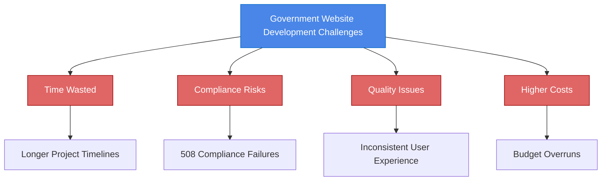

### Quantified Problem

- **Time Cost**: Developers spend 4-8 hours per component on implementation
- **Project Impact**: Average government site uses 15-20 USWDS components
- **Financial Impact**: At $100/hour developer rate, component development costs $6,000-16,000 per project
- **Quality Issues**: 30% of government sites fail accessibility compliance on first audit

## Solution Overview

ComponentCraft AI is a specialized MCP server that integrates with AI coding assistants like Cline to provide USWDS component generation capabilities for Drupal developers.

### Key Features

1. **Figma Design Analysis**: Extract design tokens and identify USWDS patterns from Figma designs
2. **Component Template Library**: Comprehensive library of USWDS components with Drupal integration
3. **Multiple Implementation Options**: Support for blocks, views, paragraphs, and other Drupal patterns
4. **Theme Integration**: Seamless integration with existing or new Drupal themes
5. **Accessibility Compliance**: Built-in accessibility validation and best practices
6. **Code Generation**: Production-ready, well-documented code output

### Value Proposition

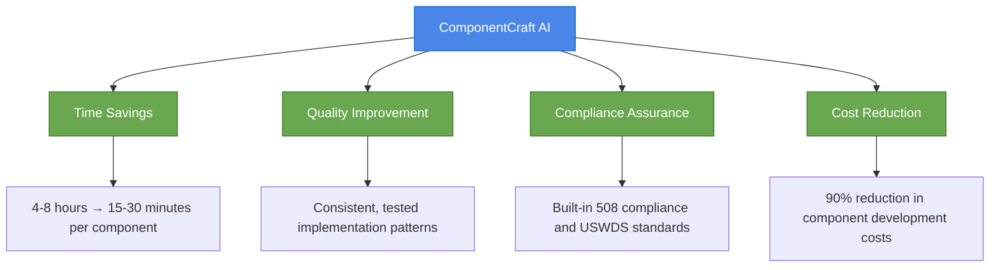

### Differentiation from General AI Tools

| Aspect | General AI Assistants | ComponentCraft AI |
|--------|----------------------|------------------|
| Knowledge Depth | Broad but shallow | Deep expertise in USWDS + Drupal |
| Workflow | Generic coding assistance | Purpose-built for USWDS components |
| Output | Code snippets | Complete, ready-to-use components |
| Compliance | Inconsistent | Guaranteed USWDS compliance |
| Design Integration | Limited | Direct Figma integration |
| Drupal Optimization | Generic code | Drupal-specific optimizations |

## Technical Architecture

### System Architecture

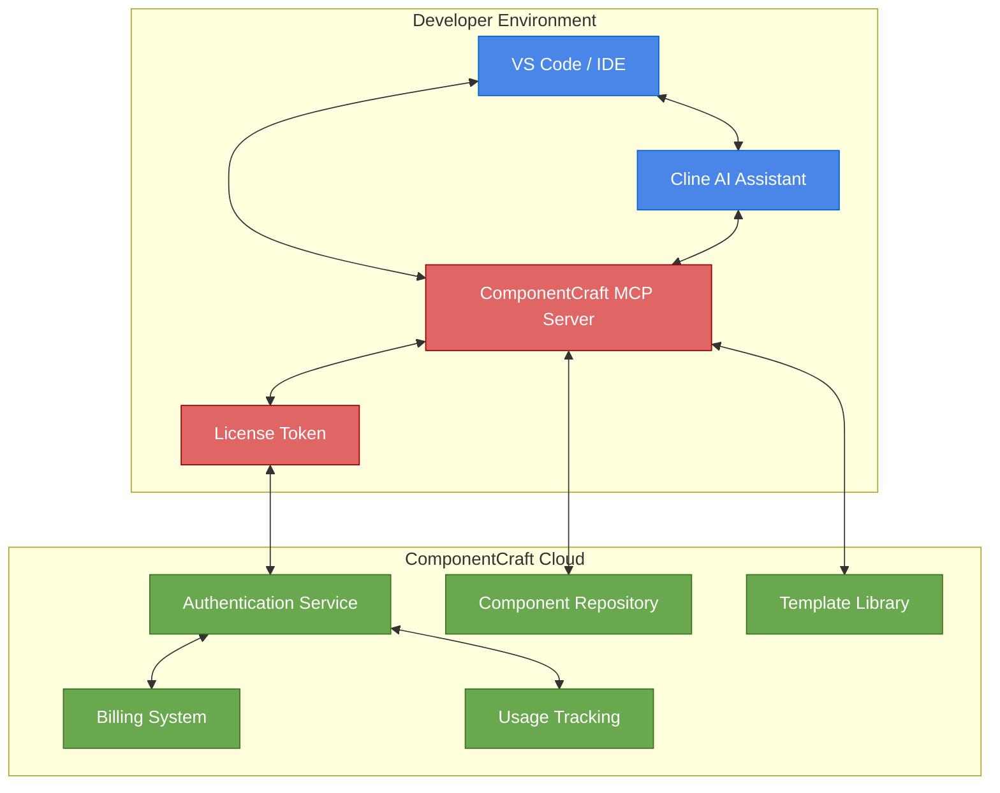

### Integration with Cline

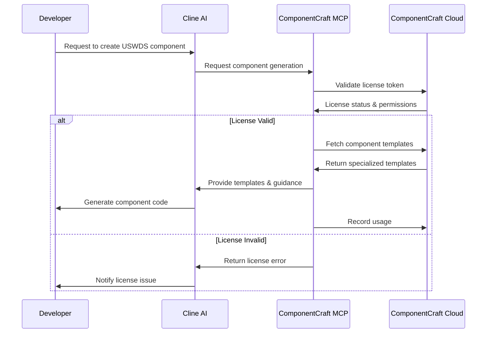

### Figma Integration

We'll use a hybrid approach that leverages the existing Figma MCP while adding our specialized functionality:

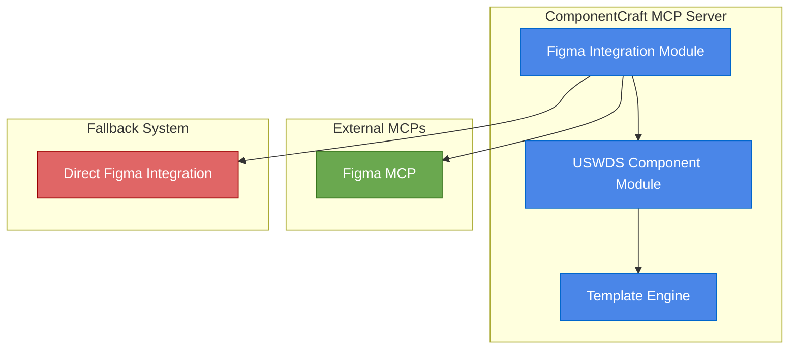

### Security & Licensing

To protect our intellectual property while allowing local execution, we'll implement:

1. **Split Functionality Architecture**: Core templates and AI models in the cloud, interface on local machine
2. **License Token System**: Secure JWT-based tokens with regular validation
3. **Usage Tracking**: Monitor component generation for billing
4. **Offline Capabilities**: Limited offline usage with synchronization

## Market Analysis

### Target Customers

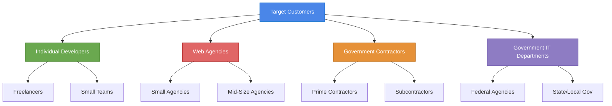

### Market Size

- **Drupal Government Sites**: 2,000+ federal government sites use Drupal
- **Government Web Spending**: $3B+ annual spending on government websites
- **Drupal Developers**: 20,000+ developers working on government Drupal sites
- **USWDS Adoption**: Growing mandate for USWDS compliance across agencies

### Competitive Landscape

| Competitor Type | Examples | Strengths | Weaknesses |
|----------------|----------|-----------|------------|
| General AI Coding Tools | GitHub Copilot, Cline, Cursor | Broad capabilities | Limited USWDS/Drupal expertise |
| Drupal Themes | USWDS Drupal Theme | Pre-built components | Limited customization |
| Component Libraries | USWDS React, USWDS Web Components | Ready-to-use components | Not Drupal-specific |
| Custom Development | Agency services | Tailored solutions | Expensive, time-consuming |

## Investment Plan

### Development Costs

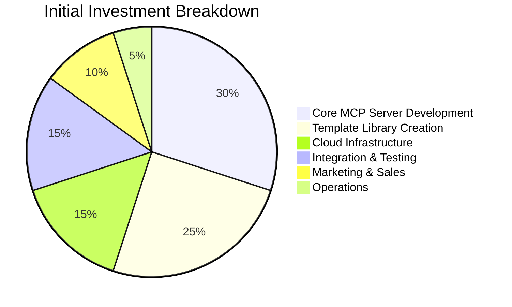

### Financial Requirements

- **MVP Development**: $150,000-250,000
- **Full Product Development**: $350,000-500,000
- **Marketing & Sales**: $100,000-150,000
- **Operations (Year 1)**: $200,000-300,000
- **Total Initial Investment**: $650,000-1,000,000

### Development Timeline

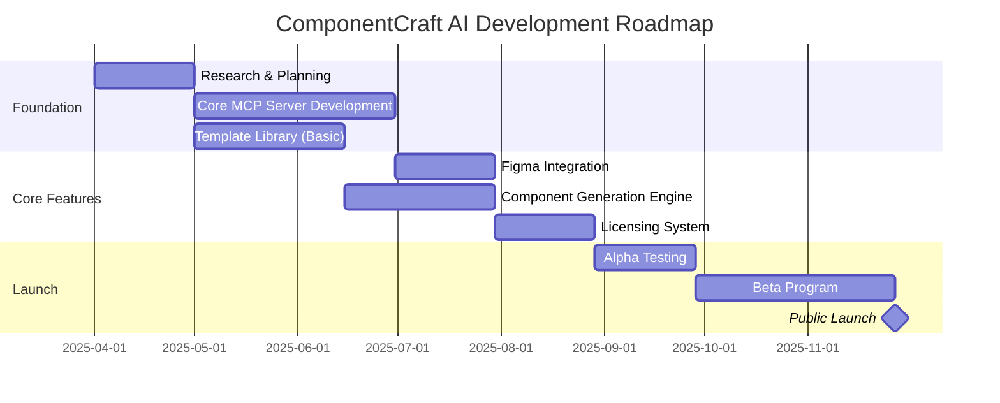

## Monetization Strategy

### Pricing Models

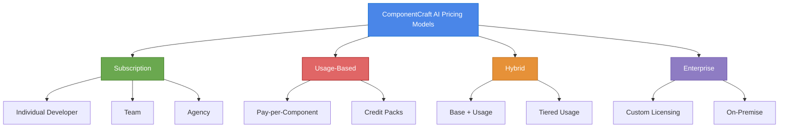

### Subscription Tiers

| Feature | Starter ($19.99/mo) | Professional ($49.99/mo) | Agency ($199.99/mo) |
|---------|---------------------|--------------------------|---------------------|
| Components/mo | 10 | 50 | Unlimited |
| Users | 1 | 3 | 10 |
| Custom library | ✓ | ✓ | ✓ |
| Figma integration | Basic | Advanced | Advanced |
| Team collaboration | - | ✓ | ✓ |
| Priority support | - | ✓ | ✓ |
| White label | - | - | ✓ |
| API access | - | - | ✓ |

### Revenue Projections

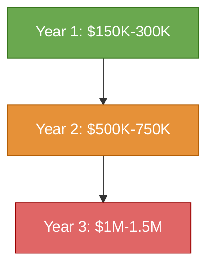

### Customer Acquisition Cost (CAC) and Lifetime Value (LTV)

| Metric | Individual | Agency | Enterprise |
|--------|------------|--------|------------|
| Avg. CAC | $200 | $1,000 | $5,000 |
| Monthly ARPU | $30 | $200 | $2,000 |
| Avg. Lifetime | 18 months | 36 months | 48 months |
| LTV | $540 | $7,200 | $96,000 |
| LTV:CAC Ratio | 2.7:1 | 7.2:1 | 19.2:1 |

## User Scenarios

### Scenario 1: Individual Developer with Figma Design

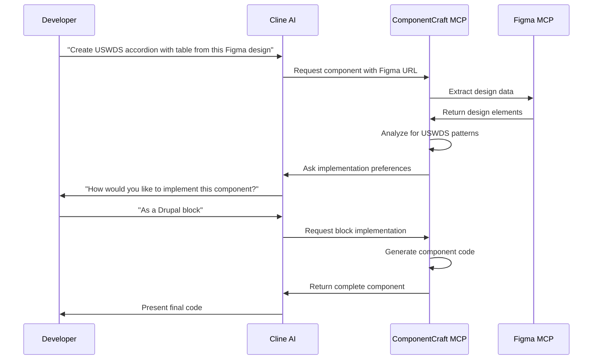

**Before ComponentCraft AI:**
- Developer spends 6 hours manually coding the component
- Needs to research USWDS specifications
- Must test for accessibility compliance
- Has to implement Drupal integration patterns

**After ComponentCraft AI:**
- Complete component generated in 15 minutes
- USWDS compliance guaranteed
- Accessibility built-in
- Drupal integration handled automatically

### Scenario 2: Agency Team Building Government Site

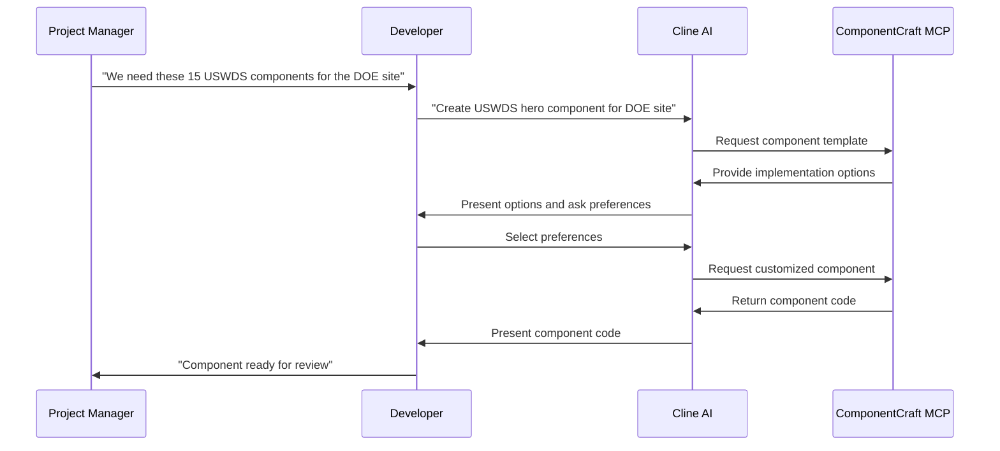

**ROI Calculation:**
- 15 components × 6 hours each = 90 hours of development time
- 90 hours × $100/hour = $9,000 cost
- With ComponentCraft AI: 15 components × 30 minutes = 7.5 hours
- 7.5 hours × $100/hour = $750 cost
- **Savings: $8,250 (92% reduction)**

### Scenario 3: Government IT Department with Existing Theme

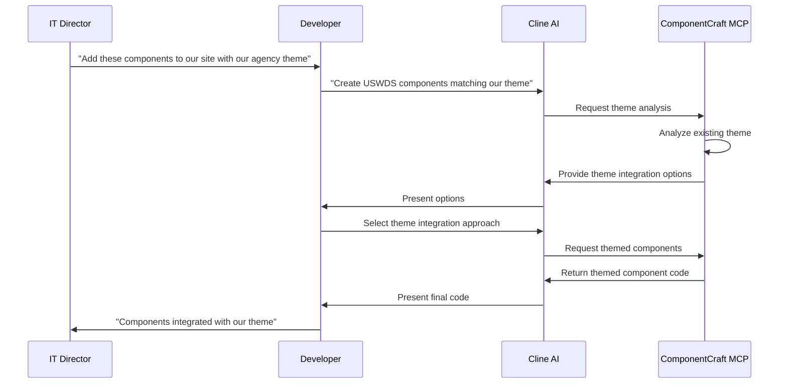

**Value Proposition:**
- Consistent branding across components
- Maintains agency design system
- Reduces theme integration time by 80%
- Ensures compliance with agency standards

## Implementation Roadmap

### Phase 1: MVP (3-4 months)
- Core MCP server implementation
- 10 most common USWDS components
- Basic Figma integration
- Subscription management system
- VS Code extension

### Phase 2: Growth (5-6 months)
- Expand to 30+ USWDS components
- Advanced Figma integration
- Team collaboration features
- Analytics dashboard
- JetBrains IDE support

### Phase 3: Enterprise (7-9 months)
- Complete USWDS component library
- Enterprise licensing system
- On-premise deployment option
- White-label capabilities
- API for custom integrations

## Risk Assessment

| Risk | Probability | Impact | Mitigation |
|------|------------|--------|------------|
| Limited market adoption | Medium | High | Free tier, targeted marketing, case studies |
| Competition from general AI | Medium | Medium | Focus on specialized expertise, integration |
| USWDS specification changes | High | Medium | Monitoring system, rapid updates |
| Figma API limitations | Medium | Medium | Hybrid approach, fallback systems |
| Licensing/piracy issues | High | Medium | Split architecture, value-based pricing |

## Conclusion

ComponentCraft AI addresses a specific, high-value pain point for Drupal developers working on government websites. By focusing on the intersection of USWDS and Drupal, we provide specialized expertise that general AI tools cannot match.

Our solution offers:
- 90% reduction in component development time
- Guaranteed USWDS and accessibility compliance
- Seamless integration with Drupal
- Significant cost savings for agencies and contractors

With a clear monetization strategy, reasonable investment requirements, and strong value proposition, ComponentCraft AI represents an attractive business opportunity in the government web development space.

The next steps are to secure initial funding, develop the MVP, and launch a beta program with select government contractors to validate the solution and refine the product before full market launch.
